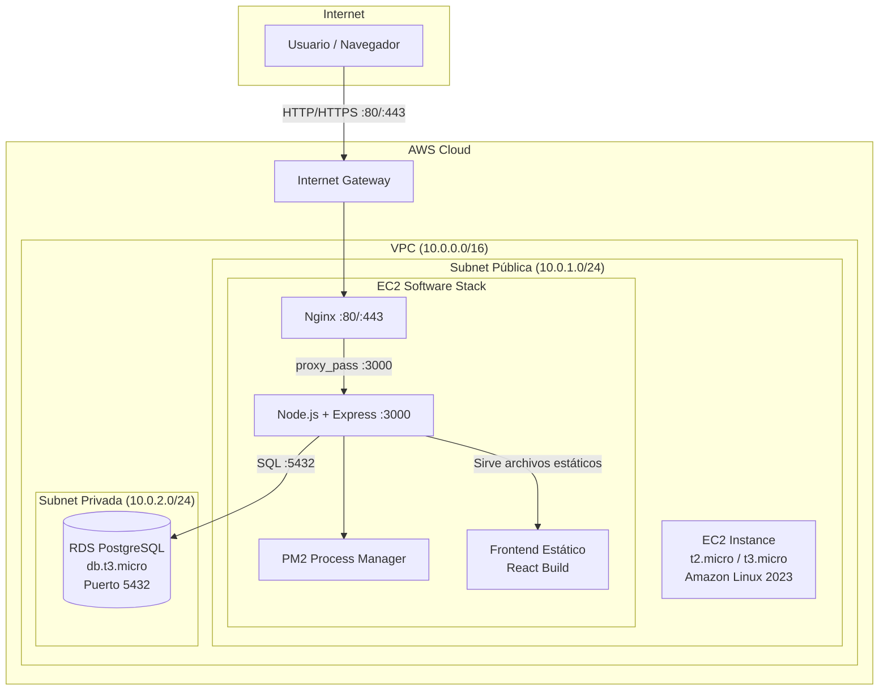
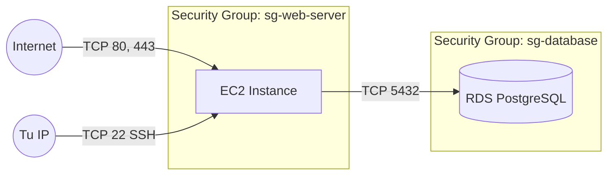
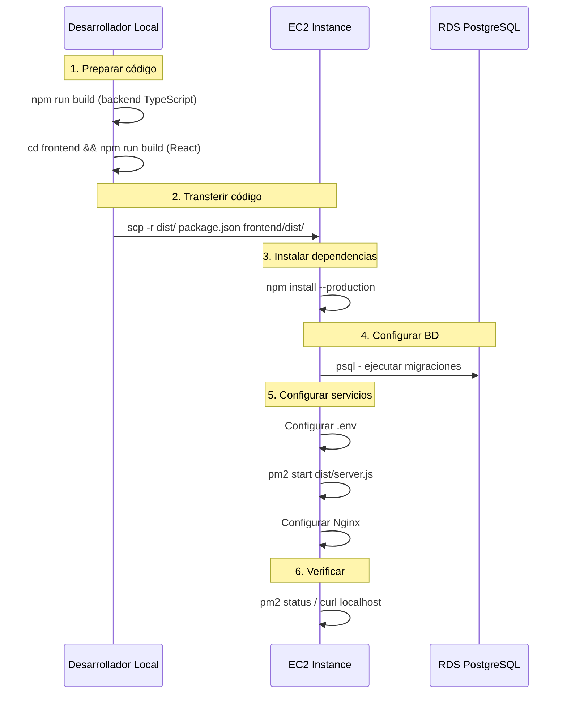

# Documento de Diseño: Despliegue en AWS

## Overview

Este documento describe la arquitectura y el proceso de despliegue de la aplicación web de clínica veterinaria en Amazon Web Services (AWS). La solución utiliza un enfoque simple y educativo: una instancia EC2 que sirve tanto el backend (Node.js/Express) como el frontend (archivos estáticos de React), una instancia RDS para PostgreSQL, y Nginx como proxy reverso. El objetivo es hacer la aplicación accesible desde Internet de forma segura y confiable.

### Decisiones de Diseño Clave

- **EC2 única para backend + frontend**: Se sirven los archivos estáticos del frontend desde el mismo servidor Express para simplificar la arquitectura. Nginx actúa como proxy reverso en el puerto 80.
- **RDS PostgreSQL**: Base de datos gestionada por AWS con backups automáticos, sin necesidad de administrar el motor de BD manualmente.
- **PM2 como process manager**: Mantiene la aplicación Node.js corriendo, la reinicia automáticamente si falla, y gestiona logs.
- **Security Groups**: Control de acceso a nivel de red — la BD solo es accesible desde la EC2, la EC2 solo expone puertos 80, 443 y 22.
- **Sin dominio propio inicialmente**: Se accede por la IP pública de la EC2. Se documenta cómo agregar HTTPS con Let's Encrypt cuando se disponga de un dominio.

## Architecture

### Diagrama de Arquitectura AWS



### Diagrama de Red y Security Groups



## Flujo de Despliegue



## Components and Interfaces

### 1. VPC y Networking

| Recurso | Configuración |
|---------|---------------|
| VPC | CIDR: 10.0.0.0/16 |
| Subnet Pública | CIDR: 10.0.1.0/24, AZ: us-east-1a |
| Subnet Privada 1 | CIDR: 10.0.2.0/24, AZ: us-east-1a |
| Subnet Privada 2 | CIDR: 10.0.3.0/24, AZ: us-east-1b (requerida por RDS) |
| Internet Gateway | Asociado a la VPC |
| Route Table Pública | 0.0.0.0/0 → Internet Gateway |

### 2. Security Groups

#### sg-web-server (para EC2)

| Tipo | Protocolo | Puerto | Origen | Descripción |
|------|-----------|--------|--------|-------------|
| Inbound | TCP | 80 | 0.0.0.0/0 | HTTP público |
| Inbound | TCP | 443 | 0.0.0.0/0 | HTTPS público |
| Inbound | TCP | 22 | TU_IP/32 | SSH solo tu IP |
| Outbound | All | All | 0.0.0.0/0 | Permitir salida |

#### sg-database (para RDS)

| Tipo | Protocolo | Puerto | Origen | Descripción |
|------|-----------|--------|--------|-------------|
| Inbound | TCP | 5432 | sg-web-server | Solo desde EC2 |
| Outbound | All | All | 0.0.0.0/0 | Permitir salida |

### 3. Instancia EC2

| Parámetro | Valor |
|-----------|-------|
| AMI | Amazon Linux 2023 (al2023-ami-*) |
| Tipo de instancia | t2.micro (Free Tier) o t3.micro |
| Key Pair | Crear nuevo o usar existente (.pem) |
| Storage | 8 GB gp3 (EBS) |
| Elastic IP | Sí (IP pública fija) |
| User Data | Script de bootstrap inicial (opcional) |

### 4. Instancia RDS PostgreSQL

| Parámetro | Valor |
|-----------|-------|
| Motor | PostgreSQL 15 o 16 |
| Clase de instancia | db.t3.micro (Free Tier) |
| Storage | 20 GB gp2 |
| Multi-AZ | No (desarrollo/aprendizaje) |
| Acceso público | No |
| DB Name | veterinary_clinic |
| Master Username | postgres |
| Master Password | (generada segura) |
| Subnet Group | Subnets privadas (10.0.2.0/24, 10.0.3.0/24) |
| Security Group | sg-database |
| Backup | 7 días retención automática |
| Encryption | Sí (KMS default) |

## Data Models

### Estructura de la Aplicación en EC2

```
/home/ec2-user/app/
├── dist/                  # Backend compilado (TypeScript → JS)
│   ├── server.js          # Entry point
│   ├── app.js
│   ├── config/
│   ├── controllers/
│   ├── middlewares/
│   ├── repositories/
│   ├── routes/
│   ├── services/
│   └── validators/
├── frontend/
│   └── dist/              # Frontend compilado (React build)
│       ├── index.html
│       └── assets/
├── node_modules/          # Dependencias de producción
├── package.json
├── package-lock.json
└── .env                   # Variables de entorno (NO en git)
```

## Configuraciones Detalladas

### Configuración de Nginx (Proxy Reverso)

```nginx
# /etc/nginx/conf.d/veterinary-app.conf

server {
    listen 80;
    server_name _;  # Acepta cualquier hostname (usar dominio cuando esté disponible)

    # Logs
    access_log /var/log/nginx/veterinary-access.log;
    error_log /var/log/nginx/veterinary-error.log;

    # Proxy para toda la aplicación (API + frontend estático)
    location / {
        proxy_pass http://127.0.0.1:3000;
        proxy_http_version 1.1;
        proxy_set_header Upgrade $http_upgrade;
        proxy_set_header Connection 'upgrade';
        proxy_set_header Host $host;
        proxy_set_header X-Real-IP $remote_addr;
        proxy_set_header X-Forwarded-For $proxy_add_x_forwarded_for;
        proxy_set_header X-Forwarded-Proto $scheme;
        proxy_cache_bypass $http_upgrade;

        # Timeouts
        proxy_connect_timeout 60s;
        proxy_send_timeout 60s;
        proxy_read_timeout 60s;
    }

    # Cache para archivos estáticos del frontend
    location ~* \.(js|css|png|jpg|jpeg|gif|ico|svg|woff|woff2|ttf|eot)$ {
        proxy_pass http://127.0.0.1:3000;
        proxy_set_header Host $host;
        expires 7d;
        add_header Cache-Control "public, immutable";
    }

    # Limitar tamaño de body (uploads)
    client_max_body_size 10M;
}
```

### Modificación del Backend para Servir Frontend Estático

```typescript
// Agregar en src/app.ts DESPUÉS de las rutas de API
import path from 'path';

// Servir archivos estáticos del frontend
app.use(express.static(path.join(__dirname, '../frontend/dist')));

// Fallback: cualquier ruta que no sea /api/* devuelve index.html (SPA routing)
app.get('*', (req, res, next) => {
  if (req.path.startsWith('/api')) {
    return next();
  }
  res.sendFile(path.join(__dirname, '../frontend/dist/index.html'));
});
```

### Configuración PM2 (ecosystem.config.js)

```javascript
// ecosystem.config.js - en /home/ec2-user/app/
module.exports = {
  apps: [{
    name: 'veterinary-api',
    script: './dist/server.js',
    instances: 1,
    autorestart: true,
    watch: false,
    max_memory_restart: '256M',
    env: {
      NODE_ENV: 'production',
      PORT: 3000
    },
    error_file: '/home/ec2-user/app/logs/error.log',
    out_file: '/home/ec2-user/app/logs/output.log',
    merge_logs: true,
    time: true
  }]
};
```

### Variables de Entorno en Producción (.env)

```bash
# /home/ec2-user/app/.env

# Database - usar endpoint de RDS
DB_HOST=veterinary-db.xxxxxxxxxxxx.us-east-1.rds.amazonaws.com
DB_PORT=5432
DB_NAME=veterinary_clinic
DB_USER=postgres
DB_PASSWORD=<contraseña-segura-generada>

# JWT
JWT_SECRET=<clave-secreta-larga-aleatoria-minimo-32-caracteres>
JWT_EXPIRATION=24h

# Server
PORT=3000
NODE_ENV=production
```

## Scripts de Despliegue

### Script 1: Configuración Inicial del Servidor EC2

```bash
#!/bin/bash
# setup-ec2.sh - Ejecutar una vez al crear la instancia EC2
# Conectarse: ssh -i "tu-key.pem" ec2-user@<EC2-PUBLIC-IP>

set -e

echo "=== Actualizando sistema ==="
sudo dnf update -y

echo "=== Instalando Node.js 20 LTS ==="
curl -fsSL https://rpm.nodesource.com/setup_20.x | sudo bash -
sudo dnf install -y nodejs

echo "=== Instalando PM2 globalmente ==="
sudo npm install -g pm2

echo "=== Instalando Nginx ==="
sudo dnf install -y nginx

echo "=== Instalando PostgreSQL client (para ejecutar migraciones) ==="
sudo dnf install -y postgresql15

echo "=== Instalando Git (opcional, para deploy con git pull) ==="
sudo dnf install -y git

echo "=== Creando directorio de la aplicación ==="
mkdir -p /home/ec2-user/app/logs

echo "=== Habilitando servicios al arranque ==="
sudo systemctl enable nginx
sudo systemctl start nginx

echo "=== Configuración de PM2 para arranque automático ==="
pm2 startup systemd -u ec2-user --hp /home/ec2-user
# Nota: ejecutar el comando que PM2 indique con sudo

echo "=== Setup completado ==="
echo "Node.js version: $(node --version)"
echo "npm version: $(npm --version)"
echo "PM2 version: $(pm2 --version)"
echo "Nginx version: $(nginx -v 2>&1)"
```

### Script 2: Despliegue de la Aplicación

```bash
#!/bin/bash
# deploy.sh - Ejecutar desde tu máquina LOCAL para desplegar
# Uso: ./deploy.sh <EC2-PUBLIC-IP> <PATH-TO-KEY.pem>

set -e

EC2_IP=$1
KEY_PATH=$2
REMOTE_USER="ec2-user"
REMOTE_DIR="/home/ec2-user/app"
LOCAL_DIR="."

if [ -z "$EC2_IP" ] || [ -z "$KEY_PATH" ]; then
    echo "Uso: ./deploy.sh <EC2-PUBLIC-IP> <PATH-TO-KEY.pem>"
    exit 1
fi

echo "=== Paso 1: Compilando backend ==="
npm run build

echo "=== Paso 2: Compilando frontend ==="
cd frontend
npm run build
cd ..

echo "=== Paso 3: Transfiriendo archivos al servidor ==="
# Crear archivo tar excluyendo node_modules y archivos innecesarios
tar -czf deploy.tar.gz \
    dist/ \
    frontend/dist/ \
    package.json \
    package-lock.json \
    migrations/ \
    ecosystem.config.js \
    --exclude='node_modules'

scp -i "$KEY_PATH" deploy.tar.gz "${REMOTE_USER}@${EC2_IP}:${REMOTE_DIR}/"

echo "=== Paso 4: Instalando en servidor remoto ==="
ssh -i "$KEY_PATH" "${REMOTE_USER}@${EC2_IP}" << 'EOF'
    cd /home/ec2-user/app
    
    # Descomprimir
    tar -xzf deploy.tar.gz
    rm deploy.tar.gz
    
    # Instalar dependencias de producción
    npm install --production
    
    # Reiniciar aplicación con PM2
    pm2 restart ecosystem.config.js --env production || pm2 start ecosystem.config.js --env production
    pm2 save
    
    echo "=== Deploy completado ==="
    pm2 status
EOF

# Limpiar archivo local
rm -f deploy.tar.gz

echo "=== ¡Despliegue exitoso! ==="
echo "La aplicación está disponible en: http://${EC2_IP}"
```

### Script 3: Ejecutar Migraciones en RDS

```bash
#!/bin/bash
# run-migrations.sh - Ejecutar DESDE la EC2 (que tiene acceso a RDS)
# Uso: ./run-migrations.sh

set -e

# Cargar variables de entorno
source /home/ec2-user/app/.env

echo "=== Ejecutando migraciones en RDS ==="
echo "Host: $DB_HOST"
echo "Database: $DB_NAME"

PGPASSWORD=$DB_PASSWORD psql \
    -h $DB_HOST \
    -p $DB_PORT \
    -U $DB_USER \
    -d $DB_NAME \
    -f /home/ec2-user/app/migrations/001_initial_schema.sql

echo "=== Migraciones completadas exitosamente ==="
```

### Script 4: Configurar Nginx

```bash
#!/bin/bash
# setup-nginx.sh - Ejecutar en la EC2 después del setup inicial

set -e

echo "=== Configurando Nginx como proxy reverso ==="

# Crear archivo de configuración
sudo tee /etc/nginx/conf.d/veterinary-app.conf > /dev/null << 'NGINX_CONF'
server {
    listen 80;
    server_name _;

    access_log /var/log/nginx/veterinary-access.log;
    error_log /var/log/nginx/veterinary-error.log;

    location / {
        proxy_pass http://127.0.0.1:3000;
        proxy_http_version 1.1;
        proxy_set_header Upgrade $http_upgrade;
        proxy_set_header Connection 'upgrade';
        proxy_set_header Host $host;
        proxy_set_header X-Real-IP $remote_addr;
        proxy_set_header X-Forwarded-For $proxy_add_x_forwarded_for;
        proxy_set_header X-Forwarded-Proto $scheme;
        proxy_cache_bypass $http_upgrade;
        proxy_connect_timeout 60s;
        proxy_send_timeout 60s;
        proxy_read_timeout 60s;
    }

    location ~* \.(js|css|png|jpg|jpeg|gif|ico|svg|woff|woff2|ttf|eot)$ {
        proxy_pass http://127.0.0.1:3000;
        proxy_set_header Host $host;
        expires 7d;
        add_header Cache-Control "public, immutable";
    }

    client_max_body_size 10M;
}
NGINX_CONF

# Eliminar configuración default si existe
sudo rm -f /etc/nginx/conf.d/default.conf

# Verificar configuración
sudo nginx -t

# Reiniciar Nginx
sudo systemctl restart nginx

echo "=== Nginx configurado exitosamente ==="
echo "Proxy reverso: puerto 80 → puerto 3000"
```

## Configuración del Frontend para Producción

### Ajuste de Vite para Build de Producción

El frontend usa un proxy de Vite en desarrollo (`/api` → `localhost:3000`). En producción, al servirse desde el mismo servidor, las peticiones a `/api/*` van directamente al backend Express sin necesidad de proxy.

```typescript
// frontend/src/services/api.ts - debe usar rutas relativas
import axios from 'axios';

const api = axios.create({
  baseURL: '/api',  // Ruta relativa - funciona tanto en dev (proxy) como prod (mismo servidor)
  headers: {
    'Content-Type': 'application/json',
  },
});

export default api;
```

**No se necesitan cambios en el frontend** si ya usa rutas relativas (`/api/...`). El proxy de Vite solo aplica en desarrollo.

## Consideraciones de Seguridad

### Principios Aplicados

1. **Mínimo privilegio en Security Groups**: La BD solo acepta conexiones desde la EC2, no desde Internet.
2. **SSH restringido**: Solo accesible desde la IP del administrador, no desde 0.0.0.0/0.
3. **Credenciales en variables de entorno**: Nunca hardcodeadas en código. El archivo `.env` tiene permisos 600.
4. **RDS sin acceso público**: La instancia RDS está en subnets privadas sin IP pública.
5. **Encryption at rest**: RDS encripta los datos almacenados con KMS.
6. **Key Pair SSH**: Usar claves RSA 2048-bit o Ed25519. Nunca compartir el archivo .pem.

### Permisos de Archivos en EC2

```bash
# Asegurar permisos del archivo .env
chmod 600 /home/ec2-user/app/.env

# Asegurar permisos del key pair (local)
chmod 400 tu-key.pem
```

### Rotación de Secretos (Recomendación)

- Cambiar `JWT_SECRET` periódicamente (invalida tokens activos)
- Cambiar contraseña de RDS desde la consola de AWS si se compromete
- Usar AWS Secrets Manager en entornos de producción real (fuera del alcance de este despliegue educativo)

## SSL/HTTPS (Opcional - Requiere Dominio)

### Opción 1: Let's Encrypt con Certbot (Gratuito)

Requiere tener un nombre de dominio apuntando a la IP de la EC2.

```bash
#!/bin/bash
# setup-ssl.sh - Ejecutar cuando tengas un dominio configurado

set -e

DOMAIN=$1

if [ -z "$DOMAIN" ]; then
    echo "Uso: ./setup-ssl.sh tu-dominio.com"
    exit 1
fi

echo "=== Instalando Certbot ==="
sudo dnf install -y certbot python3-certbot-nginx

echo "=== Obteniendo certificado SSL ==="
sudo certbot --nginx -d $DOMAIN --non-interactive --agree-tos -m tu-email@ejemplo.com

echo "=== Configurando renovación automática ==="
# Certbot ya configura un timer de systemd para renovación
sudo systemctl enable certbot-renew.timer
sudo systemctl start certbot-renew.timer

echo "=== SSL configurado ==="
echo "La aplicación está disponible en: https://${DOMAIN}"
```

### Opción 2: AWS Certificate Manager + ALB (Más robusto, tiene costo adicional)

Para entornos de producción se recomienda usar un Application Load Balancer (ALB) con un certificado gratuito de ACM. Esto queda fuera del alcance de este despliegue educativo pero se menciona como siguiente paso de evolución.

## Error Handling

### Verificaciones Post-Despliegue

```bash
# Verificar que PM2 está corriendo la aplicación
pm2 status

# Verificar que Nginx está activo
sudo systemctl status nginx

# Verificar conectividad a RDS desde EC2
PGPASSWORD=$DB_PASSWORD psql -h $DB_HOST -p 5432 -U $DB_USER -d $DB_NAME -c "SELECT 1;"

# Verificar que la app responde
curl -s http://localhost:3000/api/auth/me | head -20
curl -s http://localhost/ | head -5

# Ver logs de la aplicación
pm2 logs veterinary-api --lines 50

# Ver logs de Nginx
sudo tail -50 /var/log/nginx/veterinary-error.log
```

### Problemas Comunes y Soluciones

| Problema | Diagnóstico | Solución |
|----------|-------------|----------|
| 502 Bad Gateway | Nginx no puede conectar con Node | Verificar `pm2 status`, reiniciar app |
| Connection timeout a RDS | Security Group mal configurado | Verificar sg-database permite sg-web-server en 5432 |
| ECONNREFUSED en app | App no arrancó por error en .env | Revisar `pm2 logs`, verificar variables |
| Permiso denegado SSH | Permisos del .pem incorrectos | `chmod 400 tu-key.pem` |
| Frontend muestra página en blanco | Build no se copió correctamente | Verificar que existe `frontend/dist/index.html` |
| API retorna 404 en rutas frontend | Falta fallback a index.html | Agregar middleware de SPA routing en Express |

### Logs y Monitoreo

```bash
# Monitoreo en tiempo real con PM2
pm2 monit

# Dashboard de PM2
pm2 plus  # (requiere cuenta gratuita en pm2.io)

# Logs rotativos (evitar que los logs llenen el disco)
pm2 install pm2-logrotate
pm2 set pm2-logrotate:max_size 10M
pm2 set pm2-logrotate:retain 7
```

## Testing Strategy

### Verificaciones Manuales Post-Deploy

1. **Acceso HTTP**: Abrir `http://<EC2-IP>` en navegador → debe mostrar la app React
2. **Login funcional**: Iniciar sesión con credenciales de prueba
3. **CRUD Clientes**: Crear, listar, editar un cliente
4. **CRUD Mascotas**: Crear mascota asociada al cliente
5. **Citas**: Programar y cancelar una cita
6. **Persistencia**: Reiniciar EC2, verificar que la app arranca automáticamente y los datos persisten

### Script de Smoke Test

```bash
#!/bin/bash
# smoke-test.sh - Ejecutar después de cada deploy
# Uso: ./smoke-test.sh <EC2-PUBLIC-IP>

EC2_IP=$1
BASE_URL="http://${EC2_IP}"

echo "=== Smoke Test: Despliegue Veterinary Clinic ==="

# Test 1: Frontend accesible
echo -n "Test 1 - Frontend accesible: "
HTTP_CODE=$(curl -s -o /dev/null -w "%{http_code}" "${BASE_URL}/")
if [ "$HTTP_CODE" = "200" ]; then echo "✅ OK"; else echo "❌ FALLO (HTTP $HTTP_CODE)"; fi

# Test 2: API responde
echo -n "Test 2 - API Health: "
HTTP_CODE=$(curl -s -o /dev/null -w "%{http_code}" "${BASE_URL}/api/auth/me")
if [ "$HTTP_CODE" = "401" ]; then echo "✅ OK (401 = requiere auth)"; else echo "❌ FALLO (HTTP $HTTP_CODE)"; fi

# Test 3: Login endpoint existe
echo -n "Test 3 - Login endpoint: "
HTTP_CODE=$(curl -s -o /dev/null -w "%{http_code}" -X POST "${BASE_URL}/api/auth/login" \
    -H "Content-Type: application/json" \
    -d '{"email":"test@test.com","password":"wrong"}')
if [ "$HTTP_CODE" = "401" ] || [ "$HTTP_CODE" = "400" ]; then echo "✅ OK"; else echo "❌ FALLO (HTTP $HTTP_CODE)"; fi

# Test 4: Archivos estáticos con cache headers
echo -n "Test 4 - Cache headers en assets: "
CACHE=$(curl -s -I "${BASE_URL}/assets/" 2>/dev/null | grep -i "cache-control" | head -1)
if [ -n "$CACHE" ]; then echo "✅ OK"; else echo "⚠️  Sin cache headers (verificar manualmente)"; fi

echo ""
echo "=== Smoke Test Completado ==="
```

## Consideraciones de Rendimiento

### Instancia EC2

- **t2.micro/t3.micro**: Suficiente para desarrollo y demo. Tiene CPU credits que se acumulan en idle.
- **Monitoreo CPU**: Si los CPU credits se agotan, la instancia se ralentiza. Monitorear con CloudWatch.
- **Escalamiento vertical**: Subir a t3.small o t3.medium si se necesita más capacidad.

### RDS PostgreSQL

- **Connection Pooling**: El pool del backend (`pg` library) maneja conexiones. Configurar `max` según la instancia (db.t3.micro soporta ~60 conexiones).
- **Backups**: Los snapshots automáticos de RDS no afectan rendimiento significativamente en db.t3.micro.
- **Storage auto-scaling**: Considerar habilitar si los datos crecen más allá de 20 GB.

### Nginx

- **Worker processes**: Configurar `worker_processes auto;` (usa todos los CPUs disponibles).
- **Gzip**: Habilitar compresión para respuestas JSON y archivos estáticos.

```nginx
# Agregar en /etc/nginx/nginx.conf dentro de http {}
gzip on;
gzip_types text/plain text/css application/json application/javascript text/xml;
gzip_min_length 256;
```

## Dependencias y Costos

### Servicios AWS Utilizados

| Servicio | Tier/Costo | Notas |
|----------|-----------|-------|
| EC2 t2.micro | Free Tier (12 meses) o ~$8.50/mes | 1 vCPU, 1 GB RAM |
| RDS db.t3.micro | Free Tier (12 meses) o ~$13/mes | 1 vCPU, 1 GB RAM, 20 GB |
| Elastic IP | Gratis si está asociada a EC2 corriendo | Cobra ~$3.60/mes si NO está asociada |
| Data Transfer | 100 GB/mes gratis salida | Suficiente para app interna |
| EBS (8 GB gp3) | ~$0.64/mes | Storage de la EC2 |

**Costo estimado mensual (post Free Tier)**: ~$25-30 USD/mes

### Software en EC2

| Software | Versión | Propósito |
|----------|---------|-----------|
| Amazon Linux 2023 | Última | Sistema operativo |
| Node.js | 20 LTS | Runtime del backend |
| npm | Incluido con Node | Gestor de paquetes |
| PM2 | Última | Process manager |
| Nginx | Incluido en AL2023 repos | Proxy reverso |
| PostgreSQL Client | 15 | Para ejecutar migraciones |

## Correctness Properties

*Una propiedad es una característica o comportamiento que debe cumplirse en todas las ejecuciones válidas de un sistema — esencialmente, una declaración formal sobre lo que el sistema debe hacer. Las propiedades sirven como puente entre especificaciones legibles por humanos y garantías de corrección verificables por máquinas.*

### Property 1: SPA Routing — Rutas no-API devuelven index.html

*Para cualquier* ruta HTTP que no comience con `/api/`, el servidor Express debe responder con el contenido del archivo `index.html` del frontend, permitiendo que React Router maneje la navegación del lado del cliente.

**Validates: Requirements 7.2**

### Property 2: API Routing — Rutas /api/ son procesadas por el backend

*Para cualquier* petición HTTP a una ruta que comience con `/api/`, el servidor Express debe procesarla mediante los controladores de la API y nunca devolver el archivo index.html del frontend.

**Validates: Requirements 7.3**

### Property 3: Variables de entorno no expuestas en respuestas

*Para cualquier* respuesta generada por la API o archivo servido por el servidor, las variables de entorno sensibles (DB_PASSWORD, JWT_SECRET) nunca deben aparecer en el contenido del body de la respuesta.

**Validates: Requirements 10.2**

