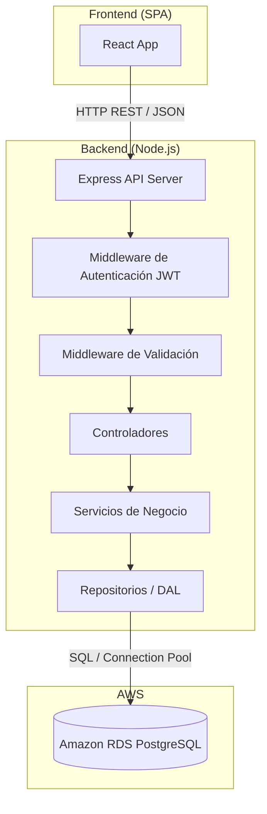
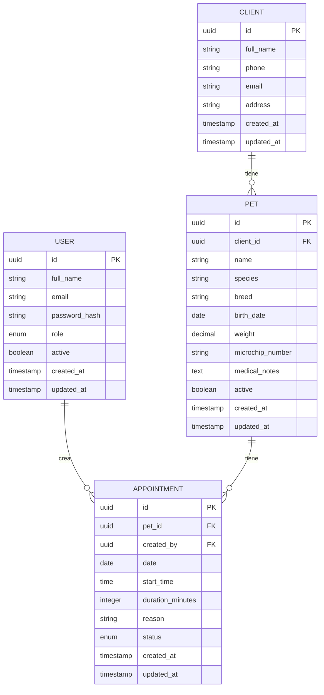

# Design Document

## Overview

Esta aplicación web para clínica veterinaria permite al personal gestionar clientes, mascotas y citas médicas a través de un panel de administración web. La arquitectura sigue un modelo cliente-servidor con un frontend SPA que se comunica con una API REST en Node.js, respaldada por una base de datos relacional gestionada en AWS (Amazon RDS con PostgreSQL).

### Decisiones de Diseño Clave

- **PostgreSQL en RDS**: Se elige PostgreSQL por su soporte robusto de integridad referencial, tipos de datos avanzados (JSONB para notas médicas extensibles) y excelente rendimiento en consultas complejas como la detección de conflictos de horarios.
- **Node.js con Express**: Framework maduro, gran ecosistema, ideal para APIs REST con validación de datos.
- **Frontend con React**: SPA con componentes reutilizables para las vistas de clientes, mascotas y citas.
- **Soft-delete para mascotas**: Las mascotas no se eliminan físicamente, se marcan como inactivas para preservar historial de citas.
- **Autenticación JWT**: Usuarios del personal (veterinarios y recepcionistas) se autentican mediante JWT para acceder a la API. Los tokens tienen expiración configurable.
- **Roles de usuario**: Dos roles (veterinario, recepcionista) con acceso completo a todas las operaciones CRUD. El sistema es extensible para agregar permisos granulares en el futuro.

## Architecture



### Capas de la Aplicación

1. **Frontend (React SPA)**: Interfaz de usuario con login, vistas para clientes, mascotas y agenda de citas.
2. **API Gateway (Express)**: Recibe peticiones HTTP, parsea JSON, enruta a controladores.
3. **Middleware de Autenticación**: Verifica JWT en cada request protegido, extrae información del usuario.
4. **Middleware de Validación**: Valida datos de entrada (formatos, rangos, campos requeridos) antes de llegar a la lógica de negocio.
5. **Controladores**: Orquestan la lógica de request/response, manejan códigos HTTP.
6. **Servicios de Negocio**: Contienen la lógica de dominio (detección de conflictos de citas, reglas de soft-delete, unicidad de contacto, hash de contraseñas).
7. **Repositorios (DAL)**: Capa de acceso a datos, ejecutan queries SQL parametrizadas contra PostgreSQL.
8. **Base de Datos (RDS PostgreSQL)**: Almacenamiento persistente con integridad referencial.

## Components and Interfaces

### API REST Endpoints

#### Autenticación (`/api/auth`)

| Método | Ruta | Descripción |
|--------|------|-------------|
| POST | `/api/auth/login` | Iniciar sesión (retorna JWT) |
| POST | `/api/auth/refresh` | Refrescar token expirado |
| GET | `/api/auth/me` | Obtener datos del usuario autenticado |

#### Usuarios del Personal (`/api/users`)

| Método | Ruta | Descripción |
|--------|------|-------------|
| POST | `/api/users` | Crear un nuevo usuario del personal |
| GET | `/api/users` | Listar usuarios del personal |
| GET | `/api/users/:id` | Obtener un usuario por ID |
| PUT | `/api/users/:id` | Actualizar un usuario |
| DELETE | `/api/users/:id` | Desactivar un usuario |

#### Clientes (`/api/clients`)

| Método | Ruta | Descripción |
|--------|------|-------------|
| POST | `/api/clients` | Crear un nuevo cliente |
| GET | `/api/clients` | Listar clientes (paginado, búsqueda) |
| GET | `/api/clients/:id` | Obtener un cliente por ID |
| PUT | `/api/clients/:id` | Actualizar un cliente |

#### Mascotas (`/api/pets`)

| Método | Ruta | Descripción |
|--------|------|-------------|
| POST | `/api/pets` | Crear una nueva mascota |
| GET | `/api/pets?clientId=X` | Listar mascotas de un cliente |
| GET | `/api/pets/:id` | Obtener una mascota por ID |
| PUT | `/api/pets/:id` | Actualizar una mascota |
| DELETE | `/api/pets/:id` | Marcar mascota como inactiva (soft-delete) |

#### Citas (`/api/appointments`)

| Método | Ruta | Descripción |
|--------|------|-------------|
| POST | `/api/appointments` | Crear una nueva cita |
| GET | `/api/appointments?date=YYYY-MM-DD` | Listar citas por fecha |
| GET | `/api/appointments?petId=X` | Historial de citas de una mascota |
| PATCH | `/api/appointments/:id/cancel` | Cancelar una cita |
| PATCH | `/api/appointments/:id/complete` | Marcar cita como completada |

### Interfaces de Servicio

```typescript
// Servicio de Autenticación
interface AuthService {
  login(email: string, password: string): Promise<{ token: string; refreshToken: string; user: User }>;
  refresh(refreshToken: string): Promise<{ token: string }>;
  validateToken(token: string): Promise<UserPayload>;
}

// Servicio de Usuarios
interface UserService {
  create(data: CreateUserDTO): Promise<User>;
  findAll(): Promise<User[]>;
  findById(id: string): Promise<User>;
  update(id: string, data: UpdateUserDTO): Promise<User>;
  deactivate(id: string): Promise<void>;
}

// Servicio de Clientes
interface ClientService {
  create(data: CreateClientDTO): Promise<Client>;
  findAll(params: PaginationParams & SearchParams): Promise<PaginatedResult<Client>>;
  findById(id: string): Promise<Client>;
  update(id: string, data: UpdateClientDTO): Promise<Client>;
}

// Servicio de Mascotas
interface PetService {
  create(data: CreatePetDTO): Promise<Pet>;
  findByClient(clientId: string): Promise<Pet[]>;
  findById(id: string): Promise<Pet>;
  update(id: string, data: UpdatePetDTO): Promise<Pet>;
  deactivate(id: string): Promise<void>;
}

// Servicio de Citas
interface AppointmentService {
  create(data: CreateAppointmentDTO): Promise<Appointment>;
  findByDate(date: string): Promise<Appointment[]>;
  findByPet(petId: string, params: PaginationParams): Promise<Appointment[]>;
  cancel(id: string): Promise<Appointment>;
  complete(id: string): Promise<Appointment>;
  checkConflict(date: string, startTime: string, duration: number, excludeId?: string): Promise<boolean>;
}
```

### DTOs de Entrada

```typescript
interface CreateUserDTO {
  fullName: string;       // 1-100 caracteres
  email: string;          // formato email válido, único
  password: string;       // mínimo 8 caracteres
  role: 'veterinarian' | 'receptionist';
}

interface LoginDTO {
  email: string;
  password: string;
}

interface CreateClientDTO {
  fullName: string;       // 1-100 caracteres
  phone?: string;         // 7-15 dígitos, prefijo "+" opcional
  email?: string;         // formato email válido
  address?: string;       // máximo 200 caracteres
}

interface CreatePetDTO {
  clientId: string;
  name: string;           // 1-100 caracteres
  species: string;        // 1-50 caracteres
  breed?: string;         // máximo 50 caracteres
  birthDate?: string;     // formato ISO 8601
  weight?: number;        // 0.01 - 999.99 kg
  microchipNumber?: string; // máximo 25 caracteres alfanuméricos, nullable
  medicalNotes?: string;  // máximo 2000 caracteres
}

interface CreateAppointmentDTO {
  petId: string;
  date: string;           // formato ISO 8601, no en el pasado
  time: string;           // formato HH:mm
  reason: string;         // máximo 500 caracteres
  duration: number;       // 15-120 minutos, incrementos de 15
}
```

## Data Models

### Diagrama Entidad-Relación



### Esquema SQL

```sql
CREATE TABLE users (
    id UUID PRIMARY KEY DEFAULT gen_random_uuid(),
    full_name VARCHAR(100) NOT NULL,
    email VARCHAR(255) NOT NULL UNIQUE,
    password_hash VARCHAR(255) NOT NULL,
    role VARCHAR(20) NOT NULL CHECK (role IN ('veterinarian', 'receptionist')),
    active BOOLEAN DEFAULT TRUE,
    created_at TIMESTAMP WITH TIME ZONE DEFAULT NOW(),
    updated_at TIMESTAMP WITH TIME ZONE DEFAULT NOW()
);

CREATE TABLE clients (
    id UUID PRIMARY KEY DEFAULT gen_random_uuid(),
    full_name VARCHAR(100) NOT NULL,
    phone VARCHAR(20),
    email VARCHAR(255),
    address VARCHAR(200),
    created_at TIMESTAMP WITH TIME ZONE DEFAULT NOW(),
    updated_at TIMESTAMP WITH TIME ZONE DEFAULT NOW(),
    CONSTRAINT chk_contact CHECK (phone IS NOT NULL OR email IS NOT NULL),
    CONSTRAINT uq_email UNIQUE (email),
    CONSTRAINT uq_phone UNIQUE (phone)
);

CREATE TABLE pets (
    id UUID PRIMARY KEY DEFAULT gen_random_uuid(),
    client_id UUID NOT NULL REFERENCES clients(id),
    name VARCHAR(100) NOT NULL,
    species VARCHAR(50) NOT NULL,
    breed VARCHAR(50),
    birth_date DATE,
    weight DECIMAL(6,2) CHECK (weight >= 0.01 AND weight <= 999.99),
    microchip_number VARCHAR(25),
    medical_notes TEXT CHECK (char_length(medical_notes) <= 2000),
    active BOOLEAN DEFAULT TRUE,
    created_at TIMESTAMP WITH TIME ZONE DEFAULT NOW(),
    updated_at TIMESTAMP WITH TIME ZONE DEFAULT NOW(),
    CONSTRAINT fk_client FOREIGN KEY (client_id) REFERENCES clients(id)
);

CREATE TABLE appointments (
    id UUID PRIMARY KEY DEFAULT gen_random_uuid(),
    pet_id UUID NOT NULL REFERENCES pets(id),
    created_by UUID REFERENCES users(id),
    date DATE NOT NULL,
    start_time TIME NOT NULL,
    duration_minutes INTEGER NOT NULL CHECK (duration_minutes >= 15 AND duration_minutes <= 120 AND duration_minutes % 15 = 0),
    reason VARCHAR(500) NOT NULL,
    status VARCHAR(20) NOT NULL DEFAULT 'scheduled' CHECK (status IN ('scheduled', 'completed', 'cancelled')),
    created_at TIMESTAMP WITH TIME ZONE DEFAULT NOW(),
    updated_at TIMESTAMP WITH TIME ZONE DEFAULT NOW(),
    CONSTRAINT fk_pet FOREIGN KEY (pet_id) REFERENCES pets(id),
    CONSTRAINT fk_created_by FOREIGN KEY (created_by) REFERENCES users(id)
);

-- Índice para detección rápida de conflictos de horario
CREATE INDEX idx_appointments_date_time ON appointments(date, start_time) WHERE status = 'scheduled';

-- Índice para búsqueda de mascotas activas por cliente
CREATE INDEX idx_pets_client_active ON pets(client_id) WHERE active = TRUE;
```

### Lógica de Detección de Conflictos

La detección de conflictos de citas se implementa como una consulta SQL que verifica solapamiento de rangos temporales:

```sql
-- Verificar si existe conflicto para una nueva cita
SELECT EXISTS (
    SELECT 1 FROM appointments
    WHERE date = $1
      AND status = 'scheduled'
      AND id != COALESCE($5, '00000000-0000-0000-0000-000000000000')
      AND (
        (start_time, start_time + (duration_minutes || ' minutes')::INTERVAL)
        OVERLAPS
        ($2::TIME, $2::TIME + ($3 || ' minutes')::INTERVAL)
      )
) AS has_conflict;
```


## Correctness Properties

*Una propiedad es una característica o comportamiento que debe cumplirse en todas las ejecuciones válidas de un sistema — esencialmente, una declaración formal sobre lo que el sistema debe hacer. Las propiedades sirven como puente entre las especificaciones legibles por humanos y las garantías de corrección verificables por máquina.*

### Property 1: Round-trip de creación de cliente

*Para cualquier* conjunto de datos de cliente con nombre entre 1-100 caracteres y al menos un dato de contacto válido (teléfono 7-15 dígitos o email con formato válido), crear el cliente y luego consultarlo por ID debe retornar exactamente los mismos datos que fueron enviados.

**Validates: Requirements 1.1, 1.4**

### Property 2: Límites de paginación

*Para cualquier* consulta paginada de clientes o historial de citas, el número de resultados retornados nunca debe exceder el límite configurado (50 para clientes, 100 para historial de citas por mascota).

**Validates: Requirements 1.2, 3.3**

### Property 3: Búsqueda parcial retorna coincidencias

*Para cualquier* criterio de búsqueda que sea substring de un nombre o teléfono existente, todos los resultados retornados deben contener ese substring en su nombre o teléfono, y el resultado debe incluir al menos el cliente original.

**Validates: Requirements 1.3**

### Property 4: Rechazo de datos de cliente inválidos

*Para cualquier* solicitud de creación de cliente donde el nombre está vacío o no tiene ni teléfono ni email, la API debe rechazar la solicitud con un error que indique los campos faltantes, y no debe crearse ningún registro.

**Validates: Requirements 1.5**

### Property 5: Unicidad de contacto

*Para cualquier* par de clientes, si el segundo intenta registrarse con el mismo email o teléfono que un cliente existente, la API debe rechazar la creación indicando el dato duplicado.

**Validates: Requirements 1.7**

### Property 6: Creación de mascota con datos válidos

*Para cualquier* datos de mascota con nombre (1-100 chars), especie (1-50 chars), peso opcional (0.01-999.99), microchip opcional (máx 25 alfanuméricos) vinculada a un cliente existente, la creación debe ser exitosa y retornar la mascota con todos los campos proporcionados.

**Validates: Requirements 2.1, 2.3**

### Property 7: Filtrado de mascotas inactivas

*Para cualquier* conjunto de mascotas asociadas a un cliente donde algunas están activas y otras inactivas, la consulta de mascotas del cliente debe retornar únicamente las mascotas con estado activo.

**Validates: Requirements 2.2**

### Property 8: Soft-delete preserva registro

*Para cualquier* mascota existente que se elimina mediante la API, el registro debe seguir existiendo en la base de datos con el campo active=false, y no debe aparecer en consultas por cliente.

**Validates: Requirements 2.4**

### Property 9: Rechazo de datos de mascota inválidos

*Para cualquier* solicitud de creación/actualización de mascota donde el nombre está vacío, la especie está vacía, el client_id no existe, o los valores numéricos están fuera de rango, la API debe rechazar la solicitud con un error descriptivo.

**Validates: Requirements 2.5**

### Property 10: Detección de conflictos de horario

*Para cualquier* par de citas en el mismo día donde el rango temporal (hora_inicio, hora_inicio + duración) de una se solapa con el rango de otra cita activa, la segunda cita debe ser rechazada indicando conflicto. Inversamente, para cualquier par de citas cuyos rangos NO se solapan, ambas deben poder crearse exitosamente.

**Validates: Requirements 3.6**

### Property 11: Ordenamiento de citas por hora

*Para cualquier* conjunto de citas programadas en un mismo día, la consulta por fecha debe retornarlas ordenadas por hora de inicio de forma ascendente.

**Validates: Requirements 3.2**

### Property 12: Máquina de estados de citas

*Para cualquier* cita en estado "programada", las transiciones a "cancelada" o "completada" deben ser exitosas. *Para cualquier* cita en estado "cancelada" o "completada", cualquier intento de transición de estado debe ser rechazado indicando que la transición no es permitida.

**Validates: Requirements 3.4, 3.5, 3.8**

### Property 13: Rechazo de citas con datos inválidos

*Para cualquier* solicitud de creación de cita donde falta la mascota, la fecha, la hora, la fecha es pasada, o la duración no está en el rango 15-120 minutos en incrementos de 15, la API debe rechazar la solicitud con un error indicando los campos inválidos.

**Validates: Requirements 3.7**

### Property 14: Integridad referencial en creación

*Para cualquier* intento de crear una mascota con un client_id inexistente, o una cita con un pet_id inexistente, la API debe rechazar la operación indicando que el recurso padre no existe.

**Validates: Requirements 5.4**

### Property 15: Protección de eliminación con dependientes

*Para cualquier* cliente que tiene mascotas asociadas, o mascota que tiene citas activas, intentar eliminarlo debe ser rechazado indicando que existen registros dependientes.

**Validates: Requirements 5.5**

### Property 16: Validación de formatos de email, teléfono y fecha

*Para cualquier* email que no contenga exactamente un "@" seguido de dominio con punto, teléfono con menos de 7 o más de 15 dígitos, o fecha que no cumpla formato ISO 8601, la API debe rechazar con error 400 indicando el campo y formato esperado. Inversamente, datos con formatos válidos deben ser aceptados.

**Validates: Requirements 7.1**

### Property 17: Formato consistente de errores

*Para cualquier* respuesta de error de la API, la respuesta debe estar en formato JSON con un campo "message" descriptivo y un campo "statusCode" numérico correspondiente al código HTTP.

**Validates: Requirements 7.3**

### Property 18: Rechazo de campos de texto excesivos

*Para cualquier* campo de texto (nombre, dirección, motivo, notas) con más de 500 caracteres de longitud, la API debe rechazar con error 400 indicando qué campo excede el límite.

**Validates: Requirements 7.5**

### Property 19: Autenticación con credenciales válidas

*Para cualquier* usuario registrado con email y contraseña válidos, el login debe retornar un token JWT válido y los datos del usuario (id, nombre, rol) sin exponer la contraseña.

**Validates: Requirements 6.2**

### Property 20: Rechazo de requests sin autenticación

*Para cualquier* solicitud a un endpoint protegido que no incluya un token JWT válido (ausente, expirado o malformado), la API debe rechazar con error 401.

**Validates: Requirements 6.4**

## Error Handling

### Estrategia de Manejo de Errores

La API implementa un manejo de errores centralizado mediante un middleware de Express que intercepta todas las excepciones y las transforma en respuestas JSON uniformes.

### Formato de Respuesta de Error

```json
{
  "statusCode": 400,
  "message": "El campo 'email' no tiene un formato válido. Se espera: usuario@dominio.com"
}
```

### Códigos HTTP y Escenarios

| Código | Escenario |
|--------|-----------|
| 400 | Validación fallida: campos requeridos faltantes, formatos inválidos, valores fuera de rango, JSON malformado |
| 401 | No autenticado: token JWT faltante, expirado o inválido |
| 403 | No autorizado: usuario no tiene permisos para la operación |
| 404 | Recurso no encontrado: ID inexistente, mascota inactiva |
| 409 | Conflicto: email/teléfono duplicado, conflicto de horario de citas |
| 503 | Servicio no disponible: timeout de conexión a base de datos (>5s) |
| 500 | Error interno: errores no manejados del servidor |

### Jerarquía de Errores en el Código

```typescript
// Errores de dominio personalizados
class AppError extends Error {
  constructor(public statusCode: number, message: string) {
    super(message);
  }
}

class ValidationError extends AppError {
  constructor(message: string) { super(400, message); }
}

class NotFoundError extends AppError {
  constructor(resource: string, id: string) {
    super(404, `${resource} con identificador '${id}' no fue encontrado`);
  }
}

class ConflictError extends AppError {
  constructor(message: string) { super(409, message); }
}

class ServiceUnavailableError extends AppError {
  constructor() { super(503, 'El servicio no está disponible temporalmente'); }
}

class UnauthorizedError extends AppError {
  constructor(message: string = 'Credenciales inválidas o token expirado') {
    super(401, message);
  }
}
```

### Middleware de Errores

```typescript
function errorHandler(err: Error, req: Request, res: Response, next: NextFunction) {
  if (err instanceof AppError) {
    return res.status(err.statusCode).json({
      statusCode: err.statusCode,
      message: err.message
    });
  }

  // Error no manejado
  console.error('Unhandled error:', err);
  return res.status(500).json({
    statusCode: 500,
    message: 'Error interno del servidor'
  });
}
```

### Validación de Entrada

Se utiliza una librería de validación (e.g., Joi o Zod) como middleware antes de cada controlador:

```typescript
// Ejemplo con Zod
const createClientSchema = z.object({
  fullName: z.string().min(1).max(100),
  phone: z.string().regex(/^\+?\d{7,15}$/).optional(),
  email: z.string().email().optional(),
  address: z.string().max(200).optional()
}).refine(data => data.phone || data.email, {
  message: 'Se requiere al menos un dato de contacto (teléfono o correo electrónico)'
});
```

### Autenticación JWT

```typescript
import jwt from 'jsonwebtoken';
import bcrypt from 'bcrypt';

// Middleware de autenticación
function authenticate(req: Request, res: Response, next: NextFunction) {
  const token = req.headers.authorization?.replace('Bearer ', '');
  if (!token) {
    throw new UnauthorizedError('Token de acceso requerido');
  }
  try {
    const payload = jwt.verify(token, process.env.JWT_SECRET!) as UserPayload;
    req.user = payload;
    next();
  } catch (err) {
    throw new UnauthorizedError('Token inválido o expirado');
  }
}

// Hash de contraseñas con bcrypt (salt rounds: 12)
async function hashPassword(password: string): Promise<string> {
  return bcrypt.hash(password, 12);
}

async function verifyPassword(password: string, hash: string): Promise<boolean> {
  return bcrypt.compare(password, hash);
}
```

### Timeout de Conexión a Base de Datos

```typescript
const pool = new Pool({
  connectionTimeoutMillis: 5000, // 5 segundos
  // ... otras opciones desde variables de entorno
});

pool.on('error', () => {
  // Log del error pero no crash del servidor
});
```

## Testing Strategy

### Enfoque Dual de Testing

La estrategia combina **tests unitarios** (ejemplos específicos y edge cases) con **property-based tests** (propiedades universales con datos aleatorios) para lograr cobertura completa.

### Property-Based Testing

**Librería**: [fast-check](https://github.com/dubzzz/fast-check) (Node.js/TypeScript)

**Configuración**: Mínimo 100 iteraciones por propiedad.

**Propiedades a implementar** (referencia a la sección Correctness Properties):
- Property 1-6: Validación y persistencia de clientes
- Property 7-9: Mascotas, filtrado y soft-delete
- Property 10-13: Citas, conflictos y máquina de estados
- Property 14-18: Integridad referencial, validación de formatos
- Property 19-20: Autenticación y autorización

**Tag format**: `Feature: veterinary-clinic-web, Property {N}: {descripción}`

Ejemplo:
```typescript
// Feature: veterinary-clinic-web, Property 10: Detección de conflictos de horario
test('overlapping appointments are rejected', () => {
  fc.assert(
    fc.property(
      appointmentArb, overlappingTimeArb,
      (existing, overlapping) => {
        // ... verificar rechazo
      }
    ),
    { numRuns: 100 }
  );
});
```

### Unit Tests (Ejemplo-Based)

Cubren los criterios clasificados como EXAMPLE y EDGE_CASE:
- **4.1-4.7**: Tests de componentes React (renderizado de secciones, notificaciones, estados vacíos)
- **5.3**: Test de timeout de conexión a BD con mock
- **6.5**: Test de unicidad de email de usuarios
- **7.2**: Test de recurso no encontrado (404)
- **7.4**: Test de JSON malformado

### Integration Tests

- Verificar conexión real a PostgreSQL (local o test container)
- Verificar integridad referencial con la BD real
- End-to-end del flujo crear cliente → crear mascota → crear cita

### Estructura de Tests

```
tests/
├── unit/
│   ├── validators/
│   │   ├── client.validator.test.ts
│   │   ├── pet.validator.test.ts
│   │   └── appointment.validator.test.ts
│   ├── services/
│   │   ├── client.service.test.ts
│   │   ├── pet.service.test.ts
│   │   └── appointment.service.test.ts
│   └── components/
│       ├── ClientList.test.tsx
│       ├── PetList.test.tsx
│       └── AppointmentCalendar.test.tsx
├── property/
│   ├── client.properties.test.ts
│   ├── pet.properties.test.ts
│   ├── appointment.properties.test.ts
│   ├── auth.properties.test.ts
│   └── validation.properties.test.ts
└── integration/
    ├── auth.integration.test.ts
    ├── client.integration.test.ts
    ├── pet.integration.test.ts
    └── appointment.integration.test.ts
```

### Herramientas

| Herramienta | Propósito |
|-------------|-----------|
| Vitest | Test runner principal |
| fast-check | Property-based testing |
| @testing-library/react | Tests de componentes |
| supertest | Tests de endpoints HTTP |
| testcontainers | PostgreSQL para integration tests |
